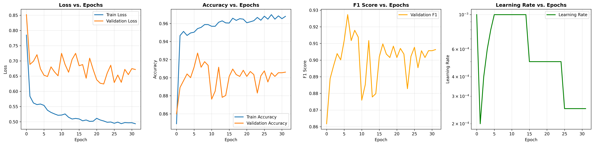
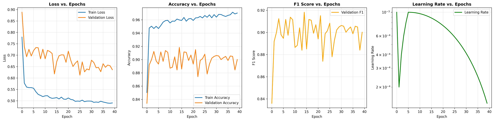

# 目前最好的结果

## 优化器adamw调度器step

最终测试结果 - Loss: 0.6699, Acc: 0.9138, F1: 0.9131
```python
混淆矩阵:
[[482  13   1   0   0   0]
 [ 66 394  11   0   0   0]
 [  0   0 420   0   0   0]
 [  0  20   0 414  54   3]
 [  0   0   0  86 446   0]
 [  0   0   0   0   0 537]]
```

## 优化器adamw调度器cosine

最终测试结果 - Loss: 0.6250, Acc: 0.9121, F1: 0.9115
```python
混淆矩阵:
[[496   0   0   0   0   0]
 [ 38 415  18   0   0   0]
 [  5  16 399   0   0   0]
 [  0  18   0 412  56   5]
 [  0   0   0 103 429   0]
 [  0   0   0   0   0 537]]
 ```