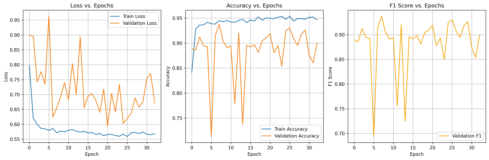

# 目前最好的结果


|   status   | precision | recall | f1-score | support |
| :--------: | :-------: | :----: | :------: | :-----: |
|  Walking   |   0.91    |  0.92  |   0.91   |   496   |
|  Upstairs  |   0.93    |  0.85  |   0.89   |   471   |
| Downstairs |   0.89    |  1.00  |   0.94   |   420   |
|  Sitting   |   0.79    |  0.77  |   0.78   |   491   |
|  Standing  |   0.82    |  0.82  |   0.82   |   532   |
|   Laying   |   0.99    |  1.00  |   0.99   |   537   |

最终测试结果 - Loss: 0.6784, Acc: 0.8904, F1: 0.8894


```python
混淆矩阵:
[[457  13  26   0   0   0]
 [ 46 399  24   0   2   0]
 [  0   0 420   0   0   0]
 [  0  17   0 376  92   6]
 [  0   0   0  97 435   0]
 [  0   0   0   0   0 537]]
```